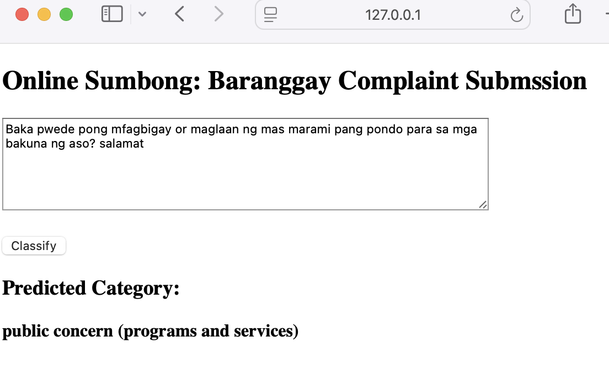
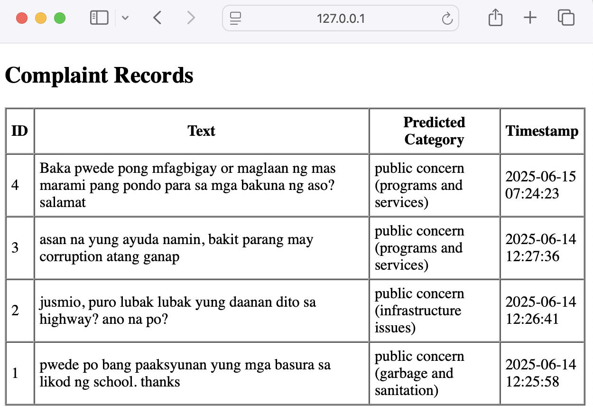

# Online Sumbong: Barangay Complaint Classification System

A lightweight Flask-based web app that allows **anonymous users** to submit complaints in Tagalog and automatically classifies them using a fine-tuned **XLM-RoBERTa** machine learning model.

This tool was created to complement our existing **Barangay Appointment System** and **Barangay Tanod Tracker**, by giving the community an easy, real-time way to voice concerns and let the LGU handle them faster and smarter.

---

## 🚀 Features

- Anonymous complaint submission
- Real-time classification using NLP
- Powered by a multilingual transformer (XLM-RoBERTa)
- SQLite database for logging and record-keeping

---

## 🛠️ Setup Instructions

1. **Create your virtual environment**

   ```bash
   python3 -m venv venv
   source venv/bin/activate  # or venv\Scripts\activate on Windows
   ```

2. **Install required packages**

```bash
pip install -r requirements.txt

```

3. **Download the .safetensor from my personal google drive. It is around 1.11 GB**

```
https://drive.google.com/file/d/1CTQAQFW_fOLs4WysBYKZen74QWM7re_-/view?usp=sharing
```

4. **Initialize the database**

```bash
python3 init_db.py
```

5. **Run the web app**

```bash
python3 main_app.py
```

6. **Access it locally**

```bash
http://localhost:9696/complaint
```

## 📦 Folder Structure

```
Online-Sumbong-Barangay-Complaint-System/
│
├── main_app.py                # Flask app
├── ml_model/
│   ├── saved_model/           # tokenizer, model files
│   ├── label_encoder.pkl
│   └── test4.ipynb      # training notebook
│
├── templates/
│   ├── complaint.html
│   └── records.html
│
├── init_db.py
├── requirements.txt
├── README.md
└── LICENSE

```

## 🧠 Model Details

- **Transformer** : XLM-RoBERTa Base
- **Fine-tuned on** : Tagalog complaints dataset (800 training, 200 validation)
- **Categories** : 'public concern (community and financial disputes)', 'public concern (garbage and sanitation)', 'public concern (infrastructure issues)', "public concern (programs and services)", "public concern (security and safety)"

### 🤗 Model on Hugging Face

You can explore and reuse the fine-tuned XLM-RoBERTa model here:

```http
https://huggingface.co/Jomsky/brgy-complaint-classifier/tree/main
```

## 🚀 Web app

- Try writing complaints by going to **http://127.0.0.1:9696/complaint.** After clicking **classify,** it should provide the category right away.
- You can check all the complains by going to **http://127.0.0.1:9696/records**



## 📌 Note

- The model file (`model.safetensors`) is too large for GitHub. It's excluded from the repo. For deployment, make sure to place it inside `model/saved_model/`.
